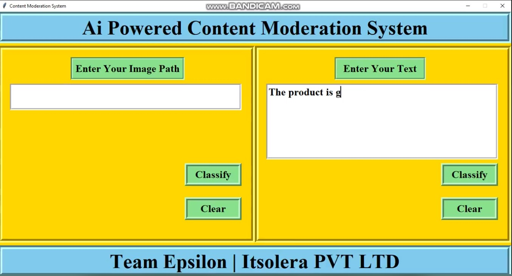

# 🤖 AI-Based Content Moderation System

[](https://www.linkedin.com/posts/arhamkhannn_%F0%9D%90%80%F0%9D%90%88-%F0%9D%90%8F%F0%9D%90%8E%F0%9D%90%96%F0%9D%90%84%F0%9D%90%91%F0%9D%90%84%F0%9D%90%83-%F0%9D%90%82%F0%9D%90%8E%F0%9D%90%8D%F0%9D%90%93%F0%9D%90%84%F0%9D%90%8D%F0%9D%90%93-%F0%9D%90%8C%F0%9D%90%8E%F0%9D%90%83-activity-7227300998887743491-TkqF?utm_source=share&utm_medium=member_desktop)

Welcome to the **AI-Based Content Moderation System**! This project aims to develop two advanced models for content moderation: one for images using Transfer Learning and CNN architecture, and the other for text moderation utilizing the BERT Transformer model.

## 📚 Overview

In today’s digital landscape, content moderation is essential for maintaining community standards and ensuring user safety. Our system addresses this need by employing cutting-edge AI techniques for both text and image content.

### 🌟 Key Features

- **Image Moderation**: 
  - Implemented using Transfer Learning and CNNs.
  - Trained on a diverse dataset from Kaggle.

- **Text Moderation**:
  - Utilizes the powerful BERT Transformer for effective text classification.
  - Data collected from Kaggle for diverse scenarios.

## 📊 Team Members

- **Ahmed Islam**
- **Rida Abid**
- **Tauseef Ahmed**
- **Muhammad Hamza Khattak**

## 📁 Repository Structure

```
.
├── .gitignore
├── LICENSE
├── README.md
├── 3.jpg
├── Text Moderation System
│   └── text_moderation_system_BERT
└── Image Moderation System
```

## 🛠️ Technologies Used

- **Python**
- **TensorFlow / Keras**
- **PyTorch**
- **BERT (Bidirectional Encoder Representations from Transformers)**
- **Transfer Learning**
  
## 📄 License

This project is licensed under the MIT License - see the [LICENSE](LICENSE) file for details.

## 🙌 Contributing

We welcome contributions! If you would like to contribute, please fork the repository and submit a pull request.

---

Thank you for checking out our project! If you have any questions or feedback, feel free to reach out.
```
